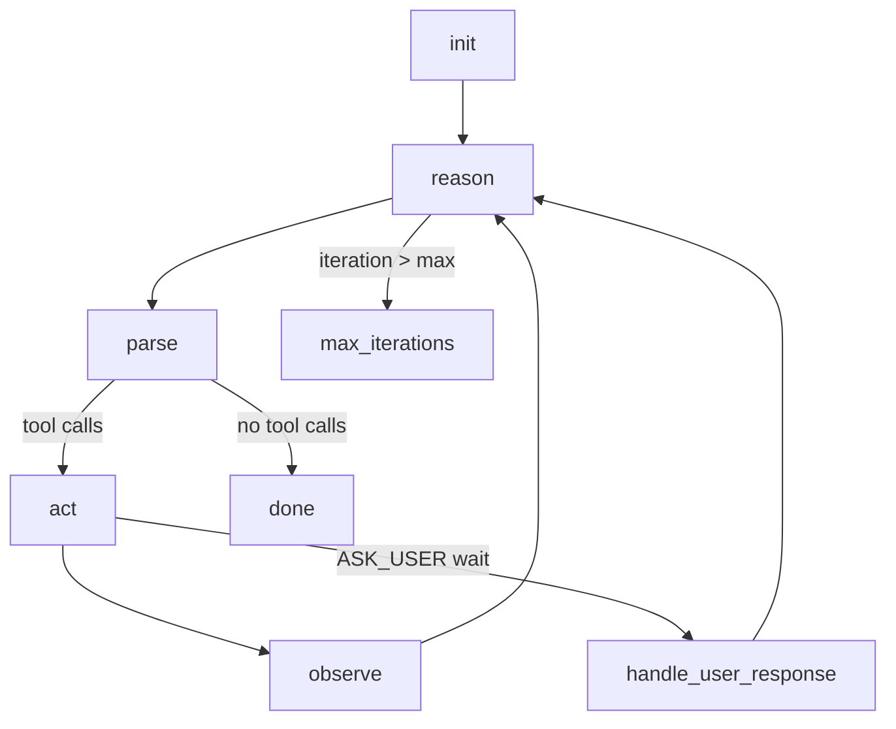

# Architecture

> Updated: 2026-02-04  
> Scope: describes **what is implemented in this repository** (no roadmap claims).

Ecosystem context:
- AbstractFramework: https://github.com/lpalbou/AbstractFramework
- AbstractCore: https://github.com/lpalbou/abstractcore
- AbstractRuntime: https://github.com/lpalbou/abstractruntime

Related docs:
- [`docs/README.md`](README.md)
- [`docs/getting-started.md`](getting-started.md)
- [`docs/agents.md`](agents.md)
- [`docs/tools.md`](tools.md)
- [`docs/persistence.md`](persistence.md)
- [`docs/react-pipeline.md`](react-pipeline.md) (ReAct deep dive)

AbstractAgent is a library of **agent patterns** (ReAct / CodeAct / MemAct) built on:
- **AbstractRuntime**: durable execution (effects, waits, run control, storage, ledger)
- **AbstractCore**: tool schemas + provider-agnostic tool-calling normalization

This package intentionally keeps **UX/UI out of scope**. The `react-agent` CLI entrypoint
in this repo is deprecated and only prints a migration message (see `src/abstractagent/repl.py`).

## Repository layout

```
src/abstractagent/
  agents/        # BaseAgent + concrete agents (ReAct / CodeAct / MemAct)
  adapters/      # logic -> WorkflowSpec (effects + durable vars schema)
  logic/         # Pure prompting/parsing logic (no runtime imports)
  tools/         # Default tool bundles + agent-specific tools
  sandbox/       # Minimal local sandbox for execute_python
  repl.py        # Deprecated CLI entrypoint
```

## Layering (how the pieces fit)

```mermaid
flowchart LR
  Host[Host app / library user] -->|create + start| AgentAPI[agents/*<br/>BaseAgent + ReactAgent/CodeActAgent/MemActAgent]
  AgentAPI --> Adapter[adapters/*_runtime.py<br/>create_*_workflow()]
  Adapter -->|WorkflowSpec + Effects| RT[AbstractRuntime]
  RT -->|LLM_CALL| Core[AbstractCore]
  RT -->|TOOL_CALLS| Tools[ToolExecutor<br/>(e.g. MappingToolExecutor)]
  Logic[logic/*<br/>build_request + parse_response] <--> Adapter
  ToolDefs[logic/builtins.py<br/>schema-only ToolDefinitions] --> Adapter
  ToolsPkg[tools/*<br/>ALL_TOOLS + execute_python + self_improve] --> Tools
```

Key rule: **logic stays runtime-agnostic**; adapters are the only place that imports `abstractruntime`.

## Durable run state model (`RunState.vars`)

All workflows follow the runtime namespace conventions (enforced via `abstractruntime.core.vars.ensure_namespaces`):

- `context`: user-visible state
  - `context.task`: current task string
  - `context.messages`: durable transcript (list of message dicts)
- `scratchpad`: agent-owned loop state (iteration counters, cycle logs, plans, flags)
- `_runtime`: runtime/host controls (provider/model overrides, allowlists, inbox, tool specs)
- `_temp`: step-local scratch (LLM response, pending tool calls, etc.)
- `_limits`: canonical resource limits (`max_iterations`, trimming knobs, token budgets, …)

Message shape is produced by `_new_message(...)` helpers inside adapters (example: `src/abstractagent/adapters/react_runtime.py`).

## Workflows (what actually runs)

### ReAct workflow (`react_agent`)

Files:
- Workflow adapter: `src/abstractagent/adapters/react_runtime.py` (`create_react_workflow`)
- Logic: `src/abstractagent/logic/react.py` (`ReActLogic`)

Runtime graph (implemented):



Highlights (code reality):
- Tool calls are parsed **only** from `response["tool_calls"]` (`ReActLogic.parse_response`); there is no parse-from-text fallback.
- The ReAct loop trace is stored under `scratchpad["cycles"]` (each cycle records `thought`, `tool_calls`, `observations`).
- Tool allowlists are computed/stored under `_runtime.allowed_tools`, and `TOOL_CALLS` effects include `allowed_tools` in payload.
- The adapter has a loop guard that can skip repeating identical **side-effect** tool calls (write/edit/execute) after a success.

### CodeAct workflow (`codeact_agent`)

Files:
- Workflow adapter: `src/abstractagent/adapters/codeact_runtime.py` (`create_codeact_workflow`)
- Logic: `src/abstractagent/logic/codeact.py` (`CodeActLogic`)

Behavior highlights:
- If the model outputs a fenced ` ```python ... ``` ` block, the adapter executes it as `execute_python`
  (`execute_code_node` in `src/abstractagent/adapters/codeact_runtime.py`).
- Optional `plan_mode` and `review_mode` are implemented for CodeAct (plan nodes + reviewer nodes in the same adapter).

### MemAct workflow (`memact_agent`)

Files:
- Workflow adapter: `src/abstractagent/adapters/memact_runtime.py` (`create_memact_workflow`)
- Logic: `src/abstractagent/logic/memact.py` (`MemActLogic`)

MemAct uses runtime-owned Active Memory:
- `init` ensures memory exists (`abstractruntime.memory.active_memory.ensure_memact_memory`)
- the workflow injects memory blocks into the system prompt and updates memory during finalization

## Tools and built-ins

See [`docs/tools.md`](tools.md).

Important “schema-only” built-ins are defined in `src/abstractagent/logic/builtins.py` and mapped to runtime effects
inside the adapters (ask_user/memory/vars/delegate).

`open_attachment` is also defined in `src/abstractagent/logic/builtins.py` and is included by default in all agents,
but it is executed as a runtime-owned tool by AbstractRuntime’s AbstractCore integration (see [`docs/tools.md`](tools.md)
and [`docs/faq.md`](faq.md)).
