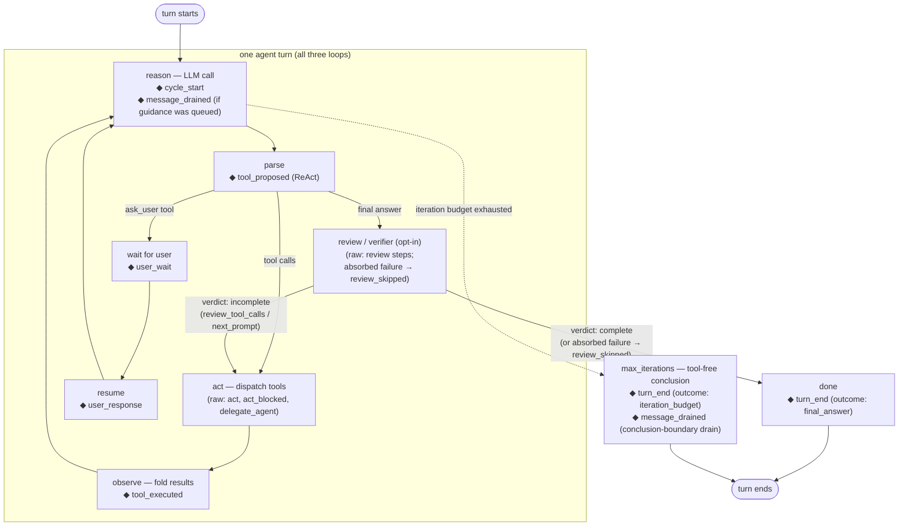

# Loop hooks (listen + steer + capture)

First-class hooks on the ReAct/CodeAct/MemAct loops. One shared contract:
`src/abstractagent/adapters/loop_hooks.py`, exported from the package root.

## Taxonomy at a glance

The event stream has **three planes**, all delivered through one handler
signature:

1. **Canonical lifecycle events** (7 names) — the stable vocabulary hosts
   subscribe to. Raw adapter steps are mapped onto them by
   `DEFAULT_EVENT_MAP` (pluggable), so the three loops speak one language
   where they share behavior.
2. **Raw pass-through steps** — every unmapped step passes through under its
   raw name. The hook set is **total, never a filter**: nothing the loop
   emits is hidden from a capture host.
3. **Hook-layer status events** — the layer reports on itself (steer queued,
   handler error contained, slow strike, undelivered steering discarded)
   through the same stream, so observability of the observer costs nothing
   extra.

There is exactly **one write channel** back into the loop: a handler's
steering return. It never touches loop state directly — it rides the durable
guidance inbox (`_runtime.inbox`, the same channel as `inject_guidance`) and
is consumed at the next reason boundary, where the loop fires
`message_drained` as the receipt.

### Where events fire in the loop



◆ = canonical event; parenthesized names are raw pass-through steps.

### The steer round-trip

```mermaid
sequenceDiagram
    participant L as Agent loop (tick thread)
    participant H as LoopHooks dispatch
    participant U as Your handler
    participant I as Durable inbox (_runtime.inbox)

    L->>H: emit(step, data)
    H->>H: map to canonical name, deep-copy payload
    H->>U: HookEvent (read-only copy)
    alt handler listens
        U-->>H: None / ""
    else handler steers
        U-->>H: "guidance" or {"inject": "guidance"}
        H->>H: queue per-run (◆ hook_steer)
        Note over H,I: folded at the loop's next drain point
        H->>I: append as durable guidance
        L->>I: next reason boundary consumes it
        L->>H: ◆ message_drained (the receipt)
    else handler misbehaves
        U--xH: raises / bad shape / too slow
        H->>H: contained (◆ hook_error / ◆ hook_slow)<br/>run unaffected; 3 slow strikes = benched
    end
```

```python
from abstractagent import LoopHooks, HookEvent, ReactAgent

def my_handler(event: HookEvent):
    # LISTEN / CAPTURE: structured, copied payload — safe to inspect anywhere.
    print(event.run_id, event.name, event.step, event.data)
    # STEER: return an injection; it folds into the DURABLE guidance inbox
    # and reaches the model at the next reason boundary.
    if event.name == "tool_executed" and event.data.get("tool") == "web_search":
        return {"inject": "Prefer primary sources over blogs."}

agent = ReactAgent(runtime=runtime, hooks=LoopHooks().add(my_handler))
```

`hooks=` is accepted by `ReactAgent`, `CodeActAgent`, `MemActAgent`, and the
three workflow factories (`create_react_workflow`, `create_codeact_workflow`,
`create_memact_workflow`). `on_step` continues to work unchanged; both
surfaces can be wired at once.

## Events

Canonical names come from `DEFAULT_EVENT_MAP` (pluggable per
`LoopHooks(event_map=...)`):

| canonical | raw step(s) | fires | loops |
|---|---|---|---|
| `cycle_start` | `reason` | each reasoning cycle begins | all three |
| `tool_proposed` | `parse_tool_calls` | model proposed a tool batch (payload: `count`) | all three (since 2026-07-15; previously ReAct-only). CodeAct's fenced-code path deliberately does NOT fire it — no tool batch is proposed there; key on `parse`'s `has_code` |
| `tool_executed` | `observe` | one tool result observed — payload carries `tool`, `success`, `result`, and `call_id` (since 2026-07-13; empty string when the batch carried none) so fleet controllers can correlate tool_call → approval → result | all three |
| `turn_end` | `done`, `max_iterations` | turn finished; `data.outcome` = `final_answer` \| `iteration_budget` | all three |
| `user_wait` | `ask_user` | loop asked the user | all three |
| `user_response` | `user_response` | user's answer resumed the loop | all three |
| `message_drained` | `inbox_drained` | delivered guidance consumed at the reason boundary (the in-loop "message received" point) | all three |

On ReAct, `turn_end` from `done` also carries `data.handed_off` (true when a
composed host — e.g. an entity visit — continues the run past this turn's
final answer). Treat `data.get("handed_off")` as ReAct-specific.

Unmapped steps pass through under their raw names — the hook set is total,
never a filter. The full per-adapter step inventory is DECLARED in
`abstractagent.adapters.emit_inventory` (`REACT_STEPS` / `CODEACT_STEPS` /
`MEMACT_STEPS`) and a drift test pins it against the actual emit call sites,
so the constants are authoritative. Highlights: `context_warning` (one-shot
`#FALLBACK` payload when estimated usage crosses `warn_tokens_pct` of the
`max_tokens` accounting ceiling), `delegate_agent_substrate` (a palette
profile was applied to a delegated child), the review/verifier steps
(`review_request`, `review`, `review_tool_calls`, `review_skipped`), and
MemAct's finalize steps (`finalize_request`, `finalize`, `finalize_skipped`,
`finalize_used_draft`).

Parse payload common core (0028 contract wave, 2026-07-14): every adapter's
`parse` payload guarantees `has_tool_calls` (bool), `tool_calls`
(list of `{name, arguments, call_id}`), and `content_preview` (≤200 chars of
model text; the string `"(no content)"` when the reply was empty — a
sentinel, not model text). Per ADR-0026 the preview is never a silent cut:
when the reply exceeds the bound the preview carries a trailing
`… [#TRUNCATION: 200 of N chars; full reply in the transcript]` marker, so a
consumer can always tell a short reply from a clipped one. Built by
`adapters.transcripts.parse_content_preview` — one helper, three loops.
Since 2026-07-27 every adapter also carries `reasoning`: the
model's separated thinking text when the provider reported one
(`response.reasoning` / `reasoning_content`), `""` when absent — one shared
reader across the three loops. Loop-specific extras (ReAct's full
`content`/`iteration`) remain additive on top — consumers key on the core.
CodeAct
asymmetry: an action can follow `has_tool_calls: false` — a fenced code
block routes to execution. CodeAct's parse payload carries the additive
`has_code` (bool) for exactly this; a consumer pre-rendering approval or
inspection UI from parse payloads must treat `has_tool_calls || has_code`
as "an action is coming" on CodeAct.

Additive on the same payload (2026-07-15): `prompt_cache` — the provider's
per-call prompt-cache telemetry struct (`mode`, `key`, `outcome`,
`cached_tokens`, `fed_tokens`, `#FALLBACK`-prefixed `degraded_reason` when
reuse degraded), lifted verbatim from the LLM result's
`metadata["prompt_cache"]`. Present exactly when the provider reported one
(core's local-cache backends today — MLX/llama.cpp lanes); absent otherwise,
never an empty placeholder. The struct's field vocabulary is core's contract,
not this layer's — treat unknown fields as additive.

Sight lane (2026-07-21, operator ruling c4089 over c3969 shape A): when a
SUCCESSFUL tool result's dict output declares a `media` list (paths or
`{"$artifact": id}` refs, authored by the producing tool — camera capture
results are the founding producer), ReAct's observe emits `media_captured`
(`{tool, count, call_id}`) and folds the refs into the NEXT reason call's
`payload.media` (or the max-iterations conclusion call when the budget wall
lands first), merged after context attachments and deduped by artifact
id/path. Consumption is ONE-SHOT per successfully parsed answer — image
tokens ride one model call, and the malformed-output retry paths
(`parse_retry_truncated`/`_empty`/`_plan_only`, plus the bounded
conclude-retry) restore the same refs so a rewrite is never image-blind; the
durable transcript keeps the tool's textual ref. Dict refs captured from
tools are stamped `origin: "tool_capture"` (provenance for degrade-not-fail
resolution — a tool-authored bogus ref should not kill the run the way a
missing host-staged attachment legitimately does; the runtime resolver half
is a filed cross-seat ask). The pending set is burst-bounded (6, most-recent
wins — a re-captured ref takes the newest slot); trims emit `media_dropped`
(`{dropped, kept, reason, dropped_keys}`), never silent. Pending refs and the
retry stash are per-turn state: `reset_react_turn` clears them at composition
boundaries. Related but distinct: the runtime's OWN attachment lane
(`_runtime.pending_media`, fed by `open_attachment`/`read_file` media
recovery in abstractruntime's effect handlers) merges at the LLM_CALL
handler below this layer — the two lanes dedup by the same artifact-id key
on the wire today; convergence is tracked with backlog 0021. Known
interaction: a framing loop of byte-identical capture batches (same tool,
same args, three consecutive) trips the 0017 stuck-streak guard like any
other repeated batch — interleaved distinct work never counts, and hosts
running deliberate watch loops own `_runtime.stuck_streak_threshold`.

Budget exhaustion emits exactly ONCE per turn (0028 multi-emit fix): ReAct's
conclusion node announces `max_iterations_reached` at first entry (before the
conclusion call's latency) and fires `max_iterations` (canonical `turn_end`,
outcome `iteration_budget`) once, at the completion branch where the turn
actually ends. Per-turn report state (`review_skipped`, MemAct's
`finalize_skipped`, the announce latch) resets at BOTH turn boundaries — the
ask_user boundary and the visit composition boundary (`reset_react_turn`) —
so reports and `complete_output` reflect the CURRENT turn; the emit/ledger
history keeps the full record.

Stability contract:

- **Canonical event names** (the table above) are frozen.
- **Raw step names** (the inventory constants) are stable-with-announced-renames;
  a rename is a contract revision, never a drive-by edit, and lands in
  `emit_inventory.RENAMED_STEPS` (the migration record). Executed at founding
  publication (2026-07-13, zero consumers existed): CodeAct's
  `parse_retry_empty_response` → `parse_retry_empty` (one semantic, one name).
  The founding asymmetry "ReAct emits no `init`" was CLOSED 2026-07-15
  (backlog 0026): all three loops now emit `init` (payload: `task`) once at
  workflow entry — a RUN moment, not a turn moment (composed visit turns
  re-enter at `reason` and never re-fire it).
- **`#FALLBACK` / `#TRUNCATION` markers** in payloads are stable.
- **Error prose is NOT a contract** — key on step names, payload keys, and
  `metadata.kind`, never on error strings. Every event carries `run_id` and
`agent` (workflow id); `iteration` is set when the underlying payload carries
one (notably `cycle_start` and ReAct's `message_drained`).

### Hook-layer status events

The layer reports on itself through the same stream (raw names, no canonical
mapping):

| step | fires |
|---|---|
| `hook_steer` | a handler's injection was queued for this run |
| `hook_error` | a handler raised, returned an unsupported shape, or steered outside a run context — contained, run unaffected |
| `hook_slow` | a handler call exceeded `slow_budget_s` (a strike) |
| `hook_steer_discarded` | a gracefully completing run dropped undelivered steering (count included) |

The durable-inbox twin (loop-layer, not hook-layer): `inbox_undelivered`
fires at a run's TRUE terminal when `_runtime.inbox` still holds guidance
that landed after the loop's last drain point — e.g. `inject_guidance`
arriving while the final/conclusion LLM call was in flight (payload:
`count`, `chars`). The entries are NOT consumed or deleted: they stay in the
completed run's durable vars as the honest record of what never got
delivered. Composition handoffs (`final_next_node`) do not fire it — the
continuing run drains the inbox at its next reason boundary.

## Contract

- **Handlers never mutate loop state.** `event.data` is a deep copy of the
  emit payload (degrading to a shallow copy only if a payload is not
  deep-copyable); the only write channel is the steering return, which rides
  the durable `_runtime.inbox` (same channel as `inject_guidance`) and is
  consumed at the next reason boundary.
- **Return contract (frozen):** `None` or `""` = pure listen; `str` or
  `{"inject": str}` = steer; anything else is reported as `hook_error`.
  Handlers receive only the `HookEvent` — no runtime, agent, or executor
  references.
- **Steering is per-run and at-most-once.** Queued injections are keyed by
  run id (one workflow product serves many runs — delegate children
  included). A gracefully completing run discards undelivered steering
  loudly (`hook_steer_discarded`). Limits to know: an injection queued but
  not yet folded dies with the process, and a run that fails or is cancelled
  does not reach the discard point — its queued steering is simply never
  delivered. Hosts needing guaranteed delivery write the run store's inbox
  directly (`BaseAgent.inject_message`) — and even that channel has a
  terminal-honesty bound: guidance landing after the loop's last drain
  cannot influence the run and is reported as `inbox_undelivered` at the
  terminal (0026 conclude-phase honesty), never silently completed over.
- **Failures are contained and observable.** A raising handler never kills
  the run; the failure surfaces as `hook_error` on the flat `on_step` stream
  AND as a pure-listen notification to the handlers themselves (returns
  ignored — no follow-up loops).
- **Slow handlers are benched.** Handlers run synchronously on the tick
  thread. Calls over `slow_budget_s` (default 1s) earn `hook_slow` strikes;
  at `max_slow_strikes` (default 3) the handler is disabled for the
  instance — main dispatches and notifications both stop, other handlers are
  unaffected, and the disable is reported as `hook_error`. Hard preemption
  of a hung handler is not provided (same exposure as a hanging `on_step`).
- **`on_step` is unchanged.** The flat `(step, data)` stream stays as-is.

## Seam (fleet / daemon designs)

Park/wake and cross-process message delivery are runtime-substrate events
(`emit_event` / `events_inbox` / `Runtime.steer` / `inject_guidance`). They
meet this layer when a delivered message lands in `_runtime.inbox`: the loop
fires `message_drained` as it consumes it — subscribe there for "a message
reached the agent's reasoning". Note that the loop's own bounded retry
nudges ride the same inbox, so `message_drained` means "the reasoning cycle
absorbed queued guidance", not necessarily "an external message arrived".
